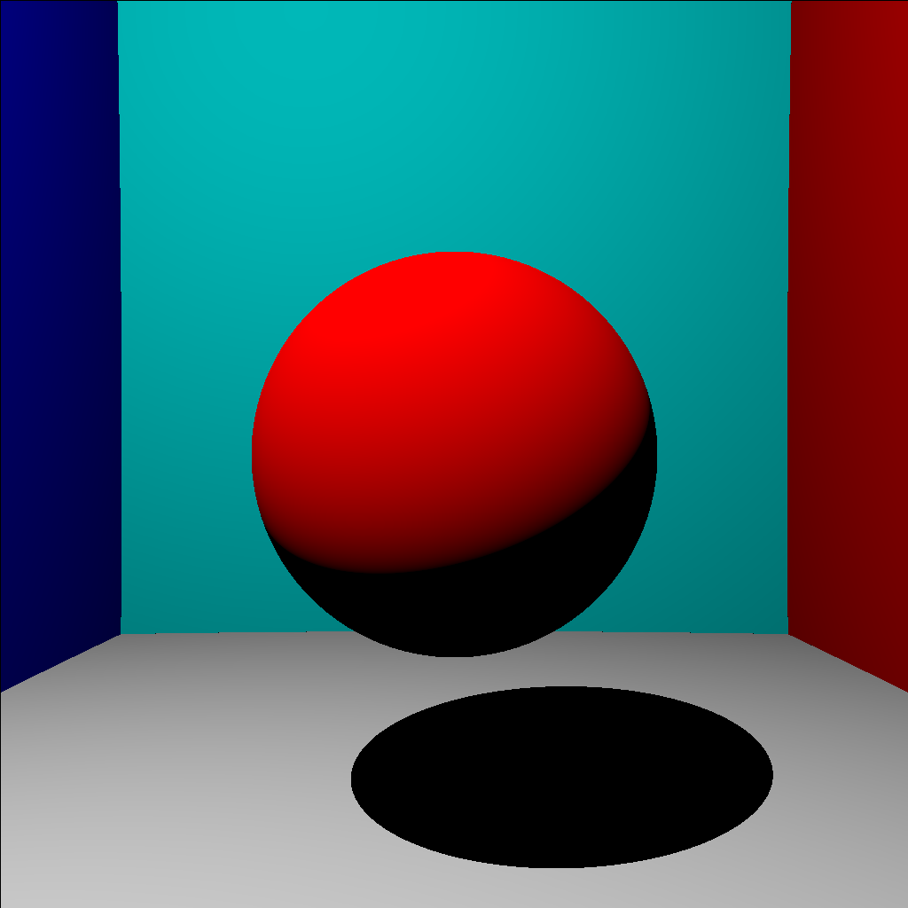
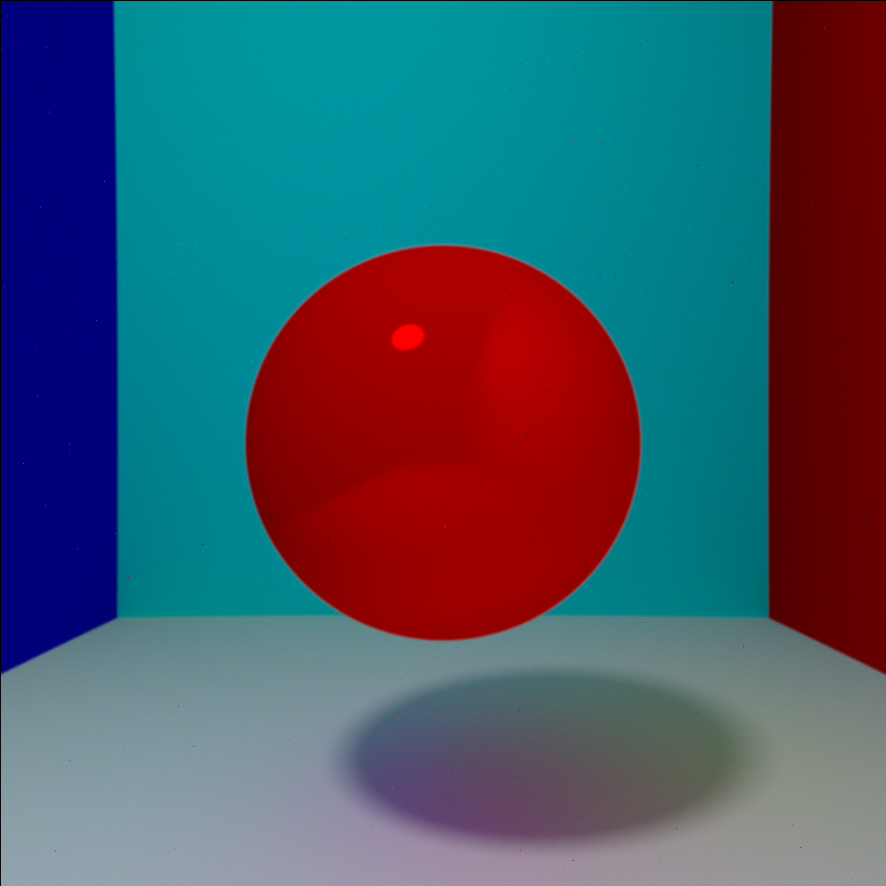
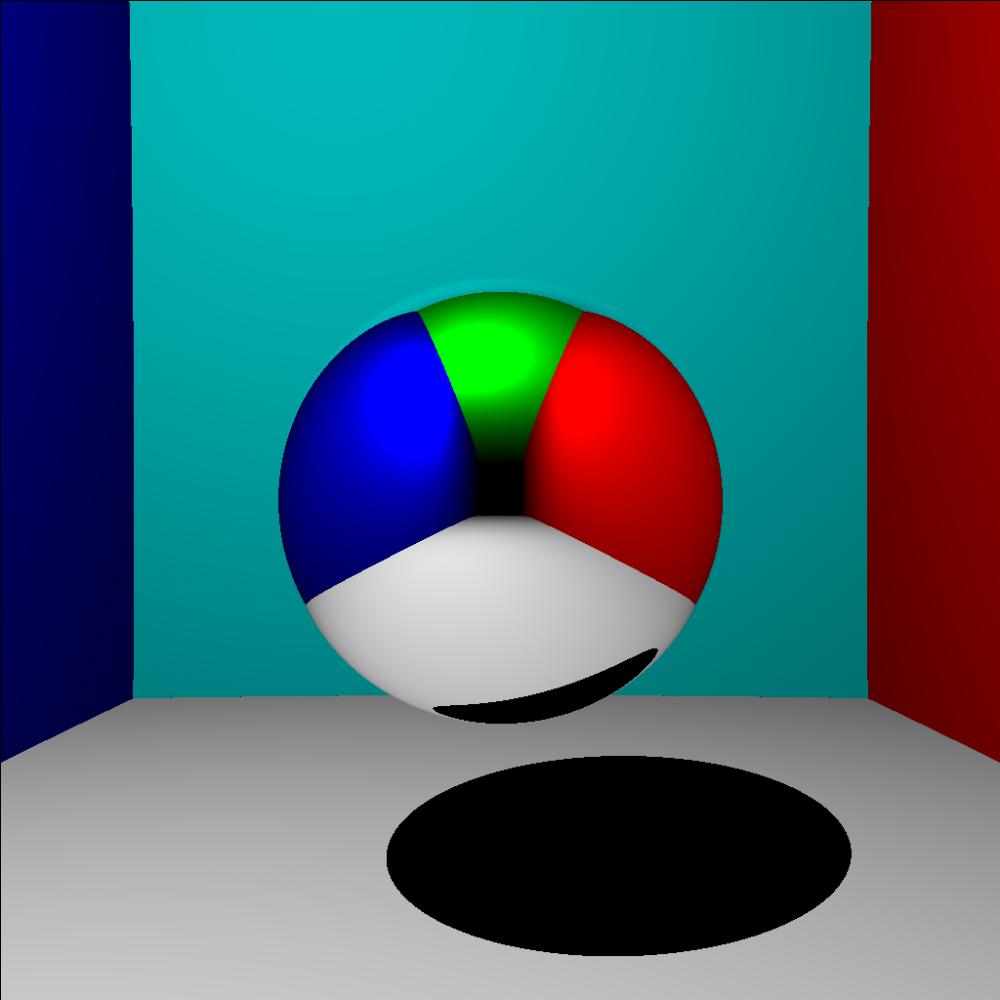
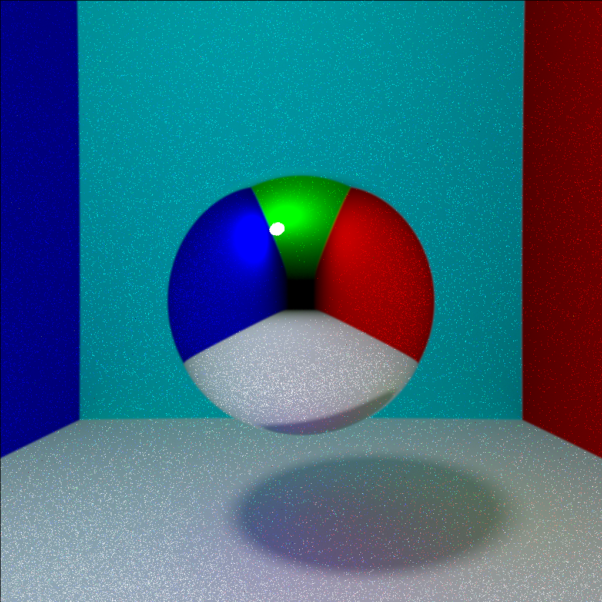
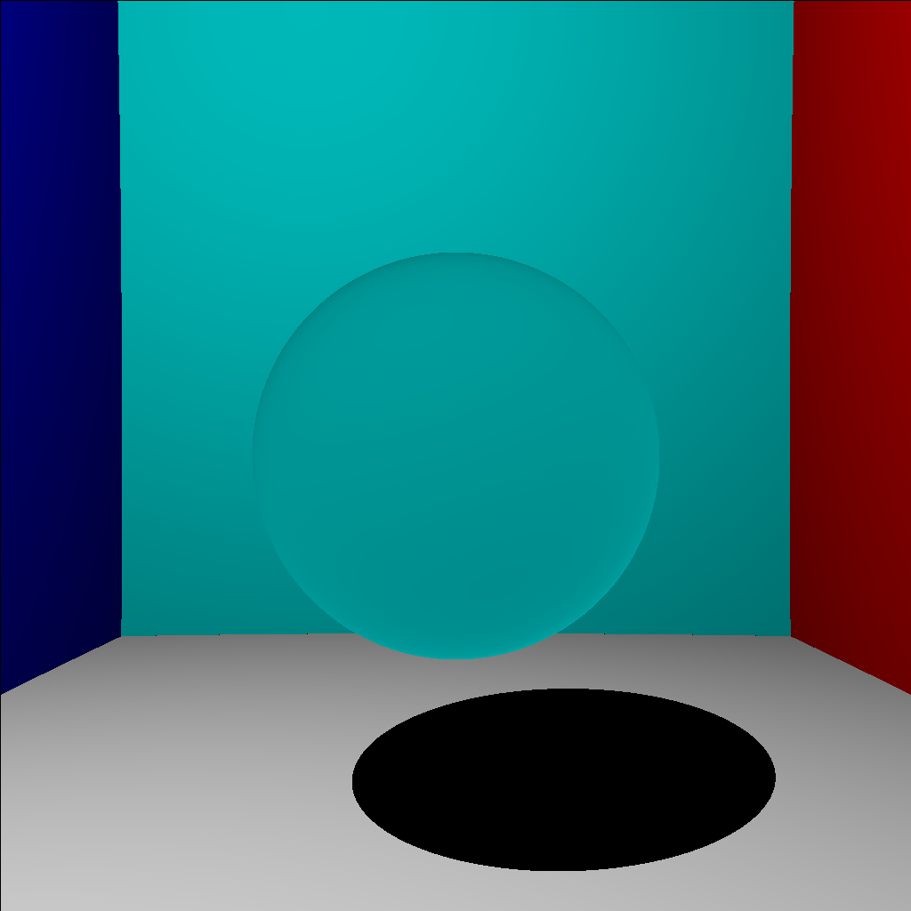
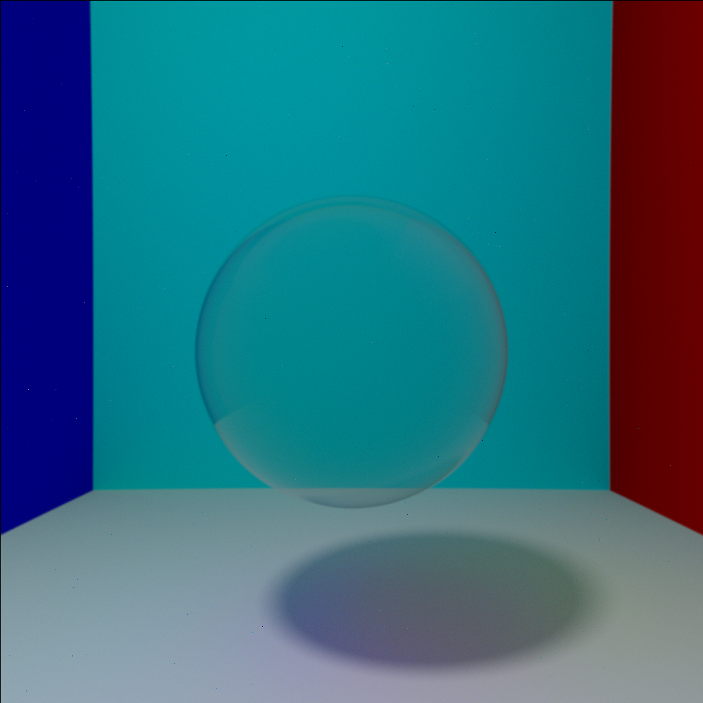

# raytracing fortran

 

This Project contains source code for a ray-tracing simulation on a sphere in a scene.
I realized this project under the Fortran 90 programming language and with the GTK libraries (gtk fortran)

 

# Video

I realized this project from the lessons of Nicolas Bonneel : https://www.youtube.com/watch?v=1HYhrx9bzP8

 

# Features

* A menu to modify the parameters of the scene and the sphere

* It can simulate with direct lighting :

	

* It can also simulate with indirect lighting (as well other functionality) :

	

* It can also simulate a mirror sphere :

    
    

* As well as a transparent sphere :

    
    

# Dependecies

You will also need the [**GTK**](https://www.gtk.org/) libraries

As well as Fortran Package Manager [**fpm**](https://fpm.fortran-lang.org/)

# Launch

Have the gfortran compiler

 

In a terminal write fpm run --flag -fopenmp

# Credits

* [**Minard Jules**](https://github.com/Minard-Jules) : Creator of the project.# raytracing_fortran
